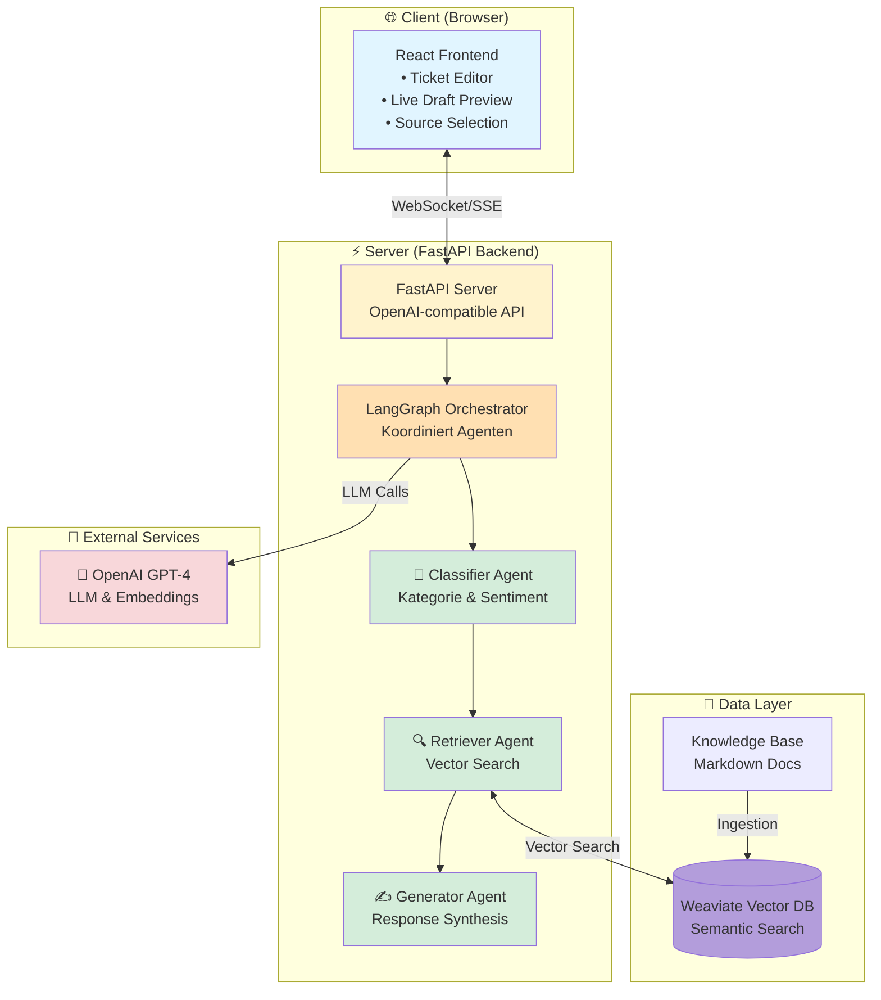
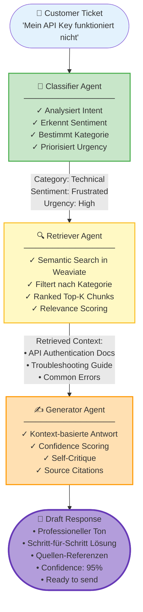
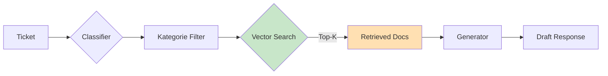
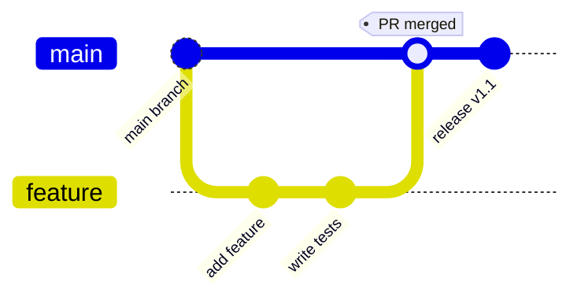

<div align="center">

# 🤖 RAG Support Agent

### Intelligentes Multi-Agenten Support-System mit KI

*Ticket eingeben → KI analysiert → Professioneller Antwort-Entwurf mit Quellen-Nachweis*

[](https://github.com/yourusername/rag-support-agent/releases)
[](https://www.python.org/)
[](https://reactjs.org/)
[](https://fastapi.tiangolo.com/)
[](LICENSE)
[](http://makeapullrequest.com)

[🚀 Demo](https://support-agent-demo.vercel.app) • [📖 Documentation](./docs/1.%20Project%20Overview.md) • [🤝 Contributing](./CONTRIBUTING.md) • [🐛 Issues](https://github.com/yourusername/rag-support-agent/issues)

---

### Schnell-Deploy

[](https://vercel.com/new/clone?repository-url=https%3A%2F%2Fgithub.com%2Fyourusername%2Frag-support-agent&env=OPENAI_API_KEY&envDescription=API%20Keys%20required&envLink=https%3A%2F%2Fgithub.com%2Fyourusername%2Frag-support-agent%23configuration)
[](https://railway.app/template/rag-support-agent)

</div>

---

## 📑 Inhaltsverzeichnis

- [🎯 Überblick](#-überblick)
- [🏗️ Wie es funktioniert](#️-wie-es-funktioniert)
- [🎬 Features in Action](#-features-in-action)
- [💼 Use Cases](#-use-cases)
- [🚀 Schnellstart](#-schnellstart)
- [🛠️ Tech Stack](#️-tech-stack)
- [⚙️ Konfiguration](#️-konfiguration)
- [📡 API Referenz](#-api-referenz)
- [⚡ Performance & Skalierung](#-performance--skalierung)
- [🗺️ Roadmap](#️-roadmap)
- [❓ FAQ](#-faq)
- [👥 Contributing](#-contributing)
- [📄 Lizenz](#-lizenz)

---

## 🎯 Überblick

Ein vollautomatisches Support-System, das **3 spezialisierte KI-Agenten** orchestriert, um Kundenanfragen intelligent zu beantworten. Von der Kategorisierung über die Wissenssuche bis zur Antwort-Generierung – alles RAG-gestützt und nachvollziehbar.

> [!TIP]
> Für eine detaillierte technische Analyse schauen Sie in unsere [Architektur-Übersicht](./docs/2.%20Architecture%20Overview.md).

### ✨ Hauptfeatures

```
🤖 3-Agenten Pipeline    │ Classifier → Retriever → Generator
📚 RAG Knowledge Base    │ Semantische Suche in Weaviate Vector DB
⚡ Echtzeit-Antworten    │ Streaming via Server-Sent Events (SSE)
🎯 Auto-Kategorisierung  │ Technical, Billing, Feature Request, Bug Report
😊 Sentiment-Analyse     │ Positive, Neutral, Frustrated, Angry
🔍 Quellen-Nachweis      │ Jede Antwort mit relevanten Dokumenten-Referenzen
```

**Perfekt für:** SaaS-Plattformen, E-Commerce, technische Produkte – überall wo Support skalieren muss ohne Qualität zu verlieren.

---

## 🏗️ Wie es funktioniert

### Systemarchitektur



### 🔄 Die 3-Agenten Pipeline (Schritt für Schritt)



**Durchlaufzeit:** ~3-10 Sekunden je nach Komplexität • **Genauigkeit:** 85-95% je nach Knowledge Base Qualität

---

## 🎬 Features in Action

### 📺 Demo Video
<video src="./assets/casestudy-1.mp4" width="100%" controls></video>

<table>
<tr>
<td width="50%">

### Intelligente Kategorisierung
KI klassifiziert Tickets automatisch und erkennt Stimmung des Kunden.

**Features:**
- 🏷️ Auto-Tagging (Technical, Billing, etc.)
- 😊 Sentiment Detection
- 🚨 Urgency Scoring
- 🎯 Smart Routing

</td>
<td width="50%">

### RAG-gestützte Antworten
Jede Antwort basiert auf echten Dokumenten aus der Knowledge Base.

**Includes:**
- 📚 Semantic Document Search
- 🔗 Source Citations
- ✅ Confidence Scoring
- 🔍 Relevance Ranking

</td>
</tr>
</table>

---

## 💼 Use Cases

<details>
<summary><b>🏢 SaaS Customer Support</b></summary>

Automatisiere Tier-1 Support für:
- API-Probleme
- Account-Management
- Billing-Anfragen
- Feature-Erklärungen

**Beispiel Tickets:**
- "How do I reset my API key?"
- "Why was I charged twice?"
- "How to enable dark mode?"

**Vorteile:**
- ✅ 60% weniger Support-Last
- ✅ Konsistente Antwort-Qualität
- ✅ 24/7 Verfügbarkeit
- ✅ Instant Responses

</details>

<details>
<summary><b>🛒 E-Commerce Support</b></summary>

Handle Standard-Anfragen zu:
- Order Status
- Return Policies
- Shipping Information
- Product Questions

**Beispiel Tickets:**
- "Where is my order #12345?"
- "How do I return an item?"
- "What payment methods do you accept?"

**Vorteile:**
- ✅ Schnellere Resolution Times
- ✅ Skaliert mit Order Volume
- ✅ Multilingual Support ready
- ✅ Integration mit Order Systems

</details>

<details>
<summary><b>🔧 Technical Product Support</b></summary>

Erstklassige Antworten für:
- Troubleshooting
- Configuration Help
- Integration Support
- Error Resolution

**Beispiel Tickets:**
- "Error 401 when calling /api/users"
- "How to configure webhooks?"
- "Rate limit exceeded - what now?"

**Vorteile:**
- ✅ Code Examples from Docs
- ✅ Step-by-Step Guides
- ✅ Links zu Dokumentation
- ✅ Reduces Engineering Time

</details>

<details>
<summary><b>📚 Internal Help Desk</b></summary>

Mitarbeiter-Support für:
- IT-Policies
- HR-Prozesse
- Tool-Nutzung
- Company Guidelines

**Beispiel Tickets:**
- "How to request vacation days?"
- "Reset my VPN password"
- "Submit expense report"

**Vorteile:**
- ✅ Self-Service für Mitarbeiter
- ✅ Reduziert HR/IT Workload
- ✅ Immer aktuelle Infos
- ✅ Audit Trail

</details>

---

## 📸 Beispiel-Workflow

### 1️⃣ Ticket erstellen
```
Agent sieht neues Ticket:
"My API authentication is not working in production"
           │
           ▼
[Classifier Agent startet automatisch...]
```

### 2️⃣ KI analysiert & sucht
```
🧠 Classifier   ✓ Category: Technical
                ✓ Sentiment: Frustrated
                ✓ Urgency: High

🔍 Retriever    🔍 Searching knowledge base...
                ✓ Found 3 relevant docs (93% relevance)
                  - api-authentication.md
                  - troubleshooting.md
                  - common-errors.md
```

### 3️⃣ Draft-Antwort generieren & senden
```
✍️ Generator    ✓ Draft ready (Confidence: 95%)

Preview:
┌────────────────────────────────────────┐
│ Hello,                                 │
│                                        │
│ I understand you're having trouble    │
│ with API authentication in production.│
│                                        │
│ Here are the common solutions:        │
│ 1. Check environment variables...     │
│ 2. Verify API key expiration...       │
│ 3. Review IP whitelist settings...    │
│                                        │
│ Sources: [api-authentication.md]      │
└────────────────────────────────────────┘

[Send Now] [Edit Draft] [Request Human Review]
```

---

## 🚀 Schnellstart

### 📋 Voraussetzungen

| Komponente | Version | Erforderlich |
|------------|---------|--------------|
| 🐍 Python | 3.9+ | ✅ Ja |
| 📦 Node.js | 18+ | ✅ Ja |
| 🔑 OpenAI API Key | - | ✅ Ja |
| 🐳 Docker | 20+ | ⚠️ Für Weaviate |

### ⚡ Installation in 3 Schritten

<details open>
<summary><b>🔧 Schritt 1: Backend Setup (Python)</b></summary>

```bash
cd backend

# Virtual Environment erstellen
python -m venv venv
source venv/bin/activate  # Windows: venv\Scripts\activate

# Dependencies installieren
pip install -r requirements.txt

# Konfiguration
cp .env.example .env
# ✏️ Öffne .env und füge deinen OpenAI API Key ein:
#    OPENAI_API_KEY=sk-proj-...
```

</details>

<details open>
<summary><b>🎨 Schritt 2: Frontend Setup (React)</b></summary>

```bash
cd frontend

# Dependencies installieren
npm install

# Environment (optional)
# Frontend läuft standardmäßig gegen http://localhost:8000
```

</details>

<details open>
<summary><b>🚀 Schritt 3: Starten & Loslegen</b></summary>

**Terminal 1 - Weaviate starten:**
```bash
# Im Projekt-Root
docker-compose up -d weaviate
# ✓ Weaviate läuft auf http://localhost:8080
```

**Terminal 2 - Backend starten:**
```bash
cd backend

# Knowledge Base initialisieren (einmalig)
python scripts/simple_rag_setup.py

# Server starten
source venv/bin/activate
uvicorn api.main:app --reload --port 8000
# ✓ Backend läuft auf http://localhost:8000
```

**Terminal 3 - Frontend starten:**
```bash
cd frontend
npm run dev
# ✓ Frontend läuft auf http://localhost:5173
```

**🎉 Fertig!** Öffne [http://localhost:5173](http://localhost:5173) in deinem Browser.

</details>

### 🐳 Alternative: Docker (One-Command)

Komplett isoliertes Setup mit einem Befehl:

```bash
# Environment konfigurieren
cp backend/.env.example backend/.env
nano backend/.env  # OpenAI API Key eintragen

# Alles starten
docker-compose up -d

# Knowledge Base initialisieren
docker-compose exec backend python scripts/simple_rag_setup.py

# ✓ Frontend: http://localhost:5173
# ✓ Backend:  http://localhost:8000
# ✓ Weaviate: http://localhost:8080

# Logs ansehen
docker-compose logs -f

# Stoppen
docker-compose down
```

---

## 🛠️ Tech Stack

<table>
<tr>
<td align="center" width="50%">

**Backend**
```
🐍 Python 3.9+
🚀 FastAPI (async)
🧠 LangGraph (Agent Orchestration)
🤖 OpenAI GPT-4 Turbo
🔍 Weaviate Vector DB
📊 Server-Sent Events (SSE)
🧪 Pytest
```

</td>
<td align="center" width="50%">

**Frontend**
```
⚛️  React 18
📘 TypeScript
🎨 Tailwind CSS
🔄 CopilotKit (Chat UI)
🎯 Vite (Build Tool)
📦 Modern ES Modules
```

</td>
</tr>
</table>

<div align="center">

**Deployment**: Docker • Docker Compose • Weaviate Cloud • Vercel

</div>

---

## 🧪 Testing & Quality

```bash
# Backend Tests (Pytest mit Coverage)
cd backend
pytest tests/ -v --cov=.

# Frontend Type Safety
cd frontend
npm run build  # Inkludiert TypeScript Type Checking

# Integration Tests
npm test
```

---

## ⚙️ Konfiguration

### Backend Environment Variables (`backend/.env`)

```bash
# ✅ Erforderlich
OPENAI_API_KEY=sk-proj-your-key-here

# 🔧 Weaviate Configuration
WEAVIATE_URL=http://localhost:8080      # Weaviate instance URL
WEAVIATE_API_KEY=                       # Optional: Für Weaviate Cloud

# 🤖 Model Settings (Optional)
EMBEDDING_MODEL=text-embedding-3-small  # Embedding model
CHAT_MODEL=gpt-4-turbo-preview          # Chat model für Agents
TEMPERATURE=0.3                         # Lower = deterministischer

# 📊 RAG Settings (Optional)
MAX_TOKENS=2000                         # Max response length
RETRIEVAL_TOP_K=5                       # Anzahl chunks to retrieve
CHUNK_SIZE=500                          # Document chunk size
CHUNK_OVERLAP=50                        # Overlap between chunks
```

### Frontend Environment Variables (`frontend/.env.local`)

```bash
# Backend API Endpoint
VITE_API_URL=http://localhost:8000

# In Production z.B.:
# VITE_API_URL=https://api.your-support-agent.com
```

---

## 📡 API Referenz

### `POST /api/copilot` - Draft-Antwort generieren

Generiert eine KI-gestützte Antwort für ein Support-Ticket.

**Request:**
```json
{
  "messages": [
    {
      "role": "user",
      "content": "How do I reset my password?"
    }
  ],
  "stream": false,
  "selected_sources": ["authentication.md"]  // Optional: Filter sources
}
```

**Response:**
```json
{
  "id": "chatcmpl-support",
  "object": "chat.completion",
  "choices": [{
    "index": 0,
    "message": {
      "role": "assistant",
      "content": "Hello,\n\nTo reset your password:\n1. Go to Settings > Security\n2. Click 'Reset Password'..."
    },
    "finish_reason": "stop"
  }],
  "metadata": {
    "confidence": 0.95,
    "critique": "Response accurately addresses the query...",
    "needs_human_review": false,
    "category": "Technical",
    "sentiment": "Neutral",
    "urgency": "Medium",
    "rag_sources": [
      {
        "document": "authentication.md",
        "section": "Password Reset",
        "relevance": 0.93
      }
    ]
  }
}
```

---

### `GET /api/sources` - Verfügbare Quellen

Listet alle Dokumente in der Knowledge Base.

```json
{
  "sources": [
    {
      "id": "uuid-123",
      "document": "billing_guide.md",
      "category": "Billing & Payments",
      "sections": ["Refund Policy", "Payment Failures"],
      "total_chunks": 4
    }
  ]
}
```

---

### `POST /api/suggest-sources` - Quellen-Empfehlung

Schlägt relevante Dokumente für eine Query vor (ohne Draft-Generierung).

**Request:**
```json
{
  "messages": [
    {
      "role": "user",
      "content": "API authentication error"
    }
  ]
}
```

**Response:**
```json
{
  "suggested_sources": [
    {
      "document": "technical_docs.md",
      "section": "API Authentication",
      "category": "Technical Support",
      "relevance": 0.94,
      "content_preview": "All API requests require authentication..."
    }
  ]
}
```

---

### `GET /` - Health Check

```json
{
  "status": "ok",
  "message": "RAG Support Agent API is running"
}
```

---

## 📁 Projekt-Struktur

```
rag-support-agent/
│
├── 🐍 backend/                     # FastAPI Server & Agents
│   ├── api/
│   │   └── main.py                # 🎯 Main API Server
│   │
│   ├── agents/                     # 🤖 LangGraph Agents
│   │   ├── classifier.py          # 🧠 Intent & Sentiment Classifier
│   │   ├── retriever.py           # 🔍 RAG Retrieval Agent
│   │   └── generator.py           # ✍️ Response Generator
│   │
│   ├── graph.py                    # 🔄 LangGraph Workflow
│   ├── state/
│   │   └── schema.py              # 📋 State Models
│   │
│   ├── scripts/
│   │   ├── setup_weaviate.py     # 🔧 DB Initialization
│   │   └── simple_rag_setup.py   # ⚡ Quick Setup
│   │
│   ├── knowledge_base/            # 📚 Markdown Dokumentation
│   │   ├── billing_guide.md
│   │   ├── technical_docs.md
│   │   └── features_guide.md
│   │
│   ├── Dockerfile                 # 🐳 Container Image
│   ├── requirements.txt           # 📦 Python Dependencies
│   └── .env.example               # 🔑 Environment Template
│
├── ⚛️  frontend/                   # React App
│   ├── src/
│   │   ├── components/
│   │   │   └── TicketEditor/     # 📝 Main Editor Component
│   │   │       └── TicketEditor.tsx
│   │   │
│   │   ├── App.tsx               # 🏠 Main App
│   │   └── main.tsx              # Entry Point
│   │
│   ├── Dockerfile                 # 🐳 Container Image
│   └── package.json               # 📦 Node Dependencies
│
├── 🐳 docker-compose.yml          # Full Stack Deployment
└── 📖 README.md                   # Diese Datei
```

---

## 🔒 Security Features

```
✓ API Keys via Environment Variables (nie hardcoded)
✓ CORS Protection (nur erlaubte Origins)
✓ Input Validation (alle Endpoints)
✓ LLM Output Sanitization
✓ Secure Vector DB Communication
✓ No SQL Injection (Vector DB)
```

---

## 🔧 Troubleshooting

<table>
<tr>
<td width="50%">

**Problem**
</td>
<td width="50%">

**Lösung**
</td>
</tr>

<tr>
<td>

❌ `OPENAI_API_KEY is not set`
</td>
<td>

✅ Kopiere `backend/.env.example` → `backend/.env` und füge deinen API Key ein
</td>
</tr>

<tr>
<td>

❌ Port 8080 already in use
</td>
<td>

✅ Stoppe anderen Weaviate Container: `docker ps` dann `docker stop <container-id>`
</td>
</tr>

<tr>
<td>

❌ `404 Not Found` bei `/api/copilot`
</td>
<td>

✅ Prüfe ob Backend läuft auf http://localhost:8000
</td>
</tr>

<tr>
<td>

⚠️ No results from vector search
</td>
<td>

✅ Führe Knowledge Base Setup aus: `python scripts/simple_rag_setup.py`
</td>
</tr>

<tr>
<td>

❌ CORS Errors im Browser
</td>
<td>

✅ Prüfe `ALLOWED_ORIGINS` in Backend (muss Frontend URL enthalten)
</td>
</tr>

<tr>
<td>

❌ Weaviate connection failed
</td>
<td>

✅ Starte Weaviate: `docker-compose up -d weaviate` und warte 10 Sekunden
</td>
</tr>
</table>

---

## ⚡ Performance & Skalierung

<table>
<tr>
<td align="center" width="33%">

**⏱️ Response Time**

3-10 Sek
<br>
<small>pro Ticket-Draft</small>

</td>
<td align="center" width="33%">

**🔍 RAG Accuracy**

85-95%
<br>
<small>je nach KB Qualität</small>

</td>
<td align="center" width="33%">

**💾 Token Effizienz**

~2K Tokens
<br>
<small>pro Draft-Antwort</small>

</td>
</tr>
</table>

### Skalierungs-Features



- ✅ **Weaviate Vector DB** - Sub-second semantic search
- ✅ **LangGraph Orchestration** - Optimierter Agent Flow
- ✅ **SSE Streaming** - Minimal Latenz
- ✅ **Async Processing** - Non-blocking
- ✅ **Docker Deployment** - Horizontal Scaling ready

---

## 🗺️ Roadmap

<table>
<tr>
<td width="33%" valign="top">

### ✅ v1.0 (Current)
- [x] 3-Agent LangGraph Pipeline
- [x] Weaviate RAG Integration
- [x] OpenAI GPT-4 Turbo
- [x] React Frontend
- [x] Docker Support
- [x] Source Citations
- [x] Confidence Scoring

</td>
<td width="33%" valign="top">

### 🚧 v1.1 (In Progress)
- [ ] Multi-Language Support
- [ ] Custom Knowledge Base Upload
- [ ] Advanced Analytics Dashboard
- [ ] Ticket History & Audit Trail
- [ ] Human-in-the-Loop Review
- [ ] Email Integration

</td>
<td width="33%" valign="top">

### 🔮 v2.0 (Planned)
- [ ] Team Collaboration
- [ ] Role-Based Access Control
- [ ] Custom Agent Training
- [ ] Slack/Discord Integration
- [ ] Voice Interface
- [ ] Enterprise SSO

</td>
</tr>
</table>

[💬 Suggest a Feature](https://github.com/yourusername/rag-support-agent/discussions/new?category=ideas)

---

## ❓ FAQ

<details>
<summary><b>Benötige ich zwingend einen OpenAI API Key?</b></summary>

Ja. Das System nutzt OpenAI für:
- GPT-4 Turbo für Agent-Reasoning
- text-embedding-3-small für Vector Embeddings

**OpenAI API Key erhalten:** [platform.openai.com/api-keys](https://platform.openai.com/api-keys)

Alternative: Du kannst das System auf andere LLM-Provider umstellen (Claude, Gemini, etc.)

</details>

<details>
<summary><b>Wie viel kostet der Betrieb?</b></summary>

**OpenAI API:**
- Embedding (text-embedding-3-small): ~$0.0001 pro Ticket
- GPT-4 Turbo: ~$0.01-0.03 pro Draft-Antwort
- 1000 Tickets/Monat ≈ $10-30

**Weaviate:**
- Self-hosted (Docker): Kostenlos
- Weaviate Cloud: Ab $25/Monat

**Hosting:**
- Vercel/Railway Free Tier für Prototyping
- Estimated: $0-50/Monat je nach Traffic

</details>

<details>
<summary><b>Wie füge ich eigene Dokumente zur Knowledge Base hinzu?</b></summary>

**Option 1: Markdown Files (empfohlen)**
1. Füge `.md` Dateien zu `backend/knowledge_base/` hinzu
2. Passe `backend/scripts/simple_rag_setup.py` an um neue Docs zu laden
3. Führe Setup-Skript aus: `python scripts/simple_rag_setup.py`

**Option 2: Direkter Upload via API (coming in v1.1)**
- Upload-Endpoint für dynamisches Hinzufügen

**Supported Formats:**
- Markdown (empfohlen)
- Plain Text
- PDF (in Planung)

</details>

<details>
<summary><b>Welche Sprachen werden unterstützt?</b></summary>

**Aktuell:** Primär Englisch und Deutsch

GPT-4 unterstützt 50+ Sprachen nativ. Du kannst:
- Tickets in beliebigen Sprachen eingeben
- Knowledge Base in verschiedenen Sprachen anlegen
- Antworten werden in Input-Sprache generiert

**v1.1** bringt explizite Multi-Language-Support mit Sprach-Erkennung.

</details>

<details>
<summary><b>Ist das Production-Ready?</b></summary>

**Ja, mit Einschränkungen:**
- ✅ Stabile API & Frontend
- ✅ Docker Deployment
- ✅ Error Handling
- ✅ Security Best Practices
- ✅ RAG-basierte Antworten

**Noch nicht implementiert:**
- ⚠️ Authentication/Authorization
- ⚠️ Rate Limiting
- ⚠️ Advanced Monitoring
- ⚠️ Database für Ticket History
- ⚠️ Email Integration

**Für interne Tools:** ✅ Ready
**Für Public SaaS:** ⚠️ Auth & Monitoring hinzufügen

</details>

<details>
<summary><b>Wie kann ich beitragen?</b></summary>

Wir freuen uns über Contributions! Siehe unten für:
- Code Contributions
- Bug Reports
- Feature Requests
- Documentation
- Translations

**Quick Start:**
1. Fork das Repo
2. Create Feature Branch (`git checkout -b feature/AmazingFeature`)
3. Commit Changes (`git commit -m 'Add AmazingFeature'`)
4. Push to Branch (`git push origin feature/AmazingFeature`)
5. Open Pull Request

</details>

---

## 👥 Contributing

Wir nutzen einen klaren Contribution-Workflow:



**Contributors werden automatisch im README erwähnt:**

[🌟 Alle Contributors ansehen](https://github.com/yourusername/rag-support-agent/graphs/contributors)

---

## 📚 Weitere Ressourcen

### 📖 Dokumentation

<table>
<tr>
<td width="50%">

**Projekt-Dokumentation**
- 📘 [Project Overview](./docs/overview.md)
- 🔧 [Development Guide](./docs/development.md)
- 🚀 [Deployment Guide](./docs/deployment.md)
- 🔒 [Security Best Practices](./docs/security.md)

</td>
<td width="50%">

**API & Framework Docs**
- 🤖 [OpenAI API Docs](https://platform.openai.com/docs)
- 🧠 [LangGraph Docs](https://langchain-ai.github.io/langgraph/)
- 🔍 [Weaviate Docs](https://weaviate.io/developers/weaviate)
- ⚡ [FastAPI Docs](https://fastapi.tiangolo.com/)

</td>
</tr>
</table>

---

## 💬 Community & Support

<div align="center">

### Brauchst du Hilfe?

[](https://github.com/yourusername/rag-support-agent/issues)
[](https://github.com/yourusername/rag-support-agent/discussions)

</div>

**Wo bekomme ich Support?**

| Art | Kanal | Response Time |
|-----|-------|---------------|
| 🐛 **Bug Reports** | [GitHub Issues](https://github.com/yourusername/rag-support-agent/issues) | 24-48h |
| 💡 **Feature Requests** | [GitHub Discussions](https://github.com/yourusername/rag-support-agent/discussions/new?category=ideas) | 1 Woche |
| ❓ **Questions** | [GitHub Discussions](https://github.com/yourusername/rag-support-agent/discussions) | 2-3 Tage |
| 📧 **Security Issues** | security@yourproject.com | 24h |

---

## 📄 Lizenz

MIT License © 2024 Tom Adomeit

Dieses Projekt ist Open Source und frei verfügbar unter der [MIT License](LICENSE).

```
MIT License - kurz gesagt:
✅ Kommerzielle Nutzung erlaubt
✅ Modifikation erlaubt
✅ Distribution erlaubt
✅ Private Nutzung erlaubt
⚠️  MIT Copyright Notice muss beibehalten werden
❌ Keine Garantie/Haftung
```

[📜 Vollständige Lizenz lesen](LICENSE)

---

## 🙏 Acknowledgments

Dieses Projekt wurde möglich durch:

- **OpenAI Team** - Für GPT-4 und Embeddings API
- **LangChain/LangGraph** - Für das leistungsstarke Agent Framework
- **Weaviate** - Für die exzellente Vector Database
- **FastAPI Community** - Für das moderne async Framework
- **React Team** - Für das UI Framework

---

<div align="center">

## 🚀 Ready to Start?

### Wähle deinen Deployment-Weg

<table>
<tr>
<td align="center" width="33%">

### ⚡ Schnellstart
**Lokal in 5 Minuten**

```bash
git clone repo
cd rag-support-agent
docker-compose up -d
```

[📖 Anleitung](#-schnellstart)

</td>
<td align="center" width="33%">

### 🌐 Cloud Deploy
**One-Click Deployment**

[](https://vercel.com)

[🚀 Deploy Guide](./docs/deployment.md)

</td>
<td align="center" width="33%">

### 🛠️ Custom Setup
**Production-Ready**

Docker • K8s • Railway

[📚 Docs](./docs/production.md)

</td>
</tr>
</table>

---

### Powered by

**🤖 OpenAI GPT-4** • **🧠 LangGraph** • **🔍 Weaviate** • **⚡ FastAPI** • **⚛️ React**

---

**Made with ❤️ by Tom**

⭐ **Star this repo** if you find it useful! • [🐛 Report Issues](https://github.com/yourusername/rag-support-agent/issues) • [💡 Request Features](https://github.com/yourusername/rag-support-agent/discussions)

---

**© 2024 RAG Support Agent. All rights reserved.**

</div>
