<div align="center">

# 🤖 RAG Support Agent

**Next-generation customer support automation powered by AI agents**

Transform customer support with intelligent agents that understand context, retrieve accurate information, and deliver human-quality responses in real-time.

[](https://opensource.org/licenses/MIT)
[](https://www.python.org/downloads/)
[](https://reactjs.org/)
[](https://fastapi.tiangolo.com/)
[](https://langchain-ai.github.io/langgraph/)
[](https://weaviate.io/)

[Demo](#-demo) • [Features](#-features) • [Quick Start](#-quick-start) • [Documentation](#-documentation) • [API](#-api-reference)

</div>

---

## 🎯 Why RAG Support Agent?

Traditional chatbots fail when they encounter questions outside their training data. RAG Support Agent solves this by:

- **🎯 Always Up-to-Date**: Pulls answers from your latest documentation, not stale training data
- **🧠 Contextually Aware**: Multi-agent architecture ensures responses are relevant and accurate
- **⚡ Real-Time Streaming**: Token-by-token responses create a natural conversation flow
- **🛡️ Grounded in Truth**: RAG prevents hallucinations by anchoring responses in your knowledge base
- **📊 Intelligent Triage**: Automatically categorizes and prioritizes tickets based on urgency and sentiment

**Perfect for:** SaaS platforms, e-commerce, technical products, or any business that needs to scale support without compromising quality.

---

## ✨ Features

### Core Capabilities

| Feature | Description |
|---------|-------------|
| 🚦 **Intelligent Routing** | Automatically categorizes tickets as _Technical_, _Billing_, _Feature Request_, or _Bug Report_ |
| 😊 **Sentiment Analysis** | Detects user frustration levels to prioritize urgent cases for human review |
| 📚 **Dynamic Knowledge Base** | Ingests Markdown documentation into Weaviate for semantic search |
| ⚡ **Streaming Responses** | Real-time token streaming via Server-Sent Events (SSE) |
| 🔄 **Multi-Agent Orchestration** | LangGraph coordinates classifier, retriever, and generator agents |
| 🎨 **Modern UI** | Built with React, TypeScript, CopilotKit, and Tailwind CSS |
| 🐳 **Docker Ready** | One-command deployment with docker-compose |

### Agent Architecture

```mermaid
graph TB
    subgraph "Client Layer"
        UI[React Frontend]
    end

    subgraph "API Gateway"
        FastAPI[FastAPI Server]
    end

    subgraph "Agent Orchestration (LangGraph)"
        Classifier[🧠 Classifier Agent<br/>Intent & Sentiment]
        Retriever[🔍 Retriever Agent<br/>Vector Search]
        Generator[✍️ Generator Agent<br/>Response Synthesis]
    end

    subgraph "Data Layer"
        Weaviate[(Weaviate Vector DB)]
        Docs[Markdown Docs]
    end

    UI -->|WebSocket| FastAPI
    FastAPI --> Classifier
    Classifier --> Retriever
    Retriever <-->|Semantic Search| Weaviate
    Retriever --> Generator
    Generator -->|SSE Stream| UI
    Docs -->|Ingestion| Weaviate

    style UI fill:#61DAFB,stroke:#333,color:#000
    style FastAPI fill:#009688,stroke:#333,color:#fff
    style Weaviate fill:#00C853,stroke:#333,color:#fff
```



---

## 🚀 Quick Start

### One-Command Setup

```bash
git clone https://github.com/yourusername/rag-support-agent.git
cd rag-support-agent
cp backend/.env.example backend/.env
# Add your OPENAI_API_KEY to backend/.env
docker-compose up -d
```

Then visit:
- **Frontend**: http://localhost:5173
- **Backend API**: http://localhost:8000/docs
- **Weaviate Console**: http://localhost:8080

### Manual Setup (Development)

#### Prerequisites

- Python 3.11+
- Node.js 18+
- OpenAI API key

#### 1️⃣ Backend Setup

```bash
cd backend

# Create virtual environment
python -m venv venv
source venv/bin/activate  # Windows: venv\Scripts\activate

# Install dependencies
pip install -r requirements.txt

# Configure environment
cp .env.example .env
# Edit .env and add your credentials
```

#### 2️⃣ Start Weaviate

```bash
# From project root
docker-compose up -d weaviate
```

#### 3️⃣ Initialize Knowledge Base

```bash
cd backend
python scripts/setup_weaviate.py
```

This will:
- Create the vector database schema
- Ingest all Markdown files from `knowledge_base/`
- Generate embeddings using OpenAI's text-embedding-3-small

#### 4️⃣ Start Backend

```bash
cd backend
uvicorn api.main:app --reload --port 8000
```

#### 5️⃣ Frontend Setup

```bash
cd frontend

# Install dependencies
npm install

# Start development server
npm run dev
```

---

## 🎬 Demo

### Chat Interface

> **User Query:** "My API key isn't working in production"

```
🧠 Classifier: Category=Technical, Urgency=High, Sentiment=Frustrated

🔍 Retriever: Found 3 relevant chunks from:
  - docs/authentication.md
  - docs/troubleshooting.md

✍️ Generator: Synthesizing response...

"I understand you're having trouble with your API key in production.
Based on our documentation, here are the most common causes:

1. **Environment Variable Mismatch**: Ensure you're using `PROD_API_KEY`
   not `DEV_API_KEY` in production.

2. **Key Rotation**: Production keys expire every 90 days. Check if
   your key was issued before [DATE].

3. **IP Whitelist**: Production requires IP whitelisting. Add your
   server IP in Dashboard > Settings > Security.

Would you like me to escalate this to our technical team for
immediate assistance?"
```

### Request Flow


---

## 🛠️ Technology Stack

<div align="center">

| Layer | Technology | Purpose |
|-------|-----------|---------|
| **Frontend** | React 18 + TypeScript | Modern, type-safe UI |
| **UI Framework** | CopilotKit + Tailwind CSS | Pre-built chat components |
| **API** | FastAPI 0.109+ | High-performance async endpoints |
| **Agent Framework** | LangGraph 0.2+ | State machine orchestration |
| **LLM** | OpenAI GPT-4 Turbo | Reasoning and generation |
| **Vector DB** | Weaviate 1.27 | Semantic search & embeddings |
| **Embedding** | text-embedding-3-small | Document vectorization |
| **Deployment** | Docker + docker-compose | Containerized infrastructure |

</div>

---

## 📁 Project Structure

```
rag-support-agent/
├── backend/
│   ├── agents/                 # Agent implementations
│   │   ├── classifier.py       # Intent/sentiment classifier
│   │   ├── retriever.py        # Vector search agent
│   │   └── generator.py        # Response generator
│   ├── api/
│   │   ├── main.py             # FastAPI application
│   │   └── routes/             # API endpoints
│   ├── graphs/
│   │   └── support_graph.py    # LangGraph workflow definition
│   ├── knowledge_base/         # Markdown documentation
│   │   ├── technical/
│   │   ├── billing/
│   │   └── features/
│   ├── scripts/
│   │   └── setup_weaviate.py   # DB initialization
│   ├── state/
│   │   └── schema.py           # State models
│   └── requirements.txt
├── frontend/
│   ├── src/
│   │   ├── components/         # React components
│   │   ├── hooks/              # Custom hooks
│   │   └── main.tsx            # Entry point
│   ├── package.json
│   └── vite.config.ts
├── docs/                       # Additional documentation
├── docker-compose.yml          # Service orchestration
└── README.md
```

---

## ⚙️ Configuration

### Environment Variables

Create a `backend/.env` file with the following:

```bash
# Required
OPENAI_API_KEY=sk-proj-...              # OpenAI API key

# Weaviate Configuration
WEAVIATE_URL=http://localhost:8080      # Weaviate instance URL
WEAVIATE_API_KEY=                       # Optional: For cloud deployments

# Model Settings (Optional)
EMBEDDING_MODEL=text-embedding-3-small  # Default embedding model
CHAT_MODEL=gpt-4-turbo-preview          # Default chat model
TEMPERATURE=0.3                         # Lower = more deterministic

# Application Settings (Optional)
MAX_TOKENS=2000                         # Max response length
RETRIEVAL_TOP_K=5                       # Number of chunks to retrieve
CHUNK_SIZE=500                          # Document chunk size
CHUNK_OVERLAP=50                        # Overlap between chunks
```

### Customizing the Knowledge Base

1. Add Markdown files to `backend/knowledge_base/`:
   ```
   knowledge_base/
   ├── technical/
   │   ├── api-authentication.md
   │   └── webhooks.md
   ├── billing/
   │   └── subscription-management.md
   └── features/
       └── new-dashboard.md
   ```

2. Re-run ingestion:
   ```bash
   python scripts/setup_weaviate.py
   ```

3. The system will automatically:
   - Split documents into chunks
   - Generate embeddings
   - Store in Weaviate
   - Make available for retrieval

---

## 📖 Documentation

### Agent Details

#### 🧠 Classifier Agent
- **Input**: Raw user query
- **Output**: `{category, urgency, sentiment}`
- **Model**: GPT-4 Turbo with structured output
- **Categories**: Technical, Billing, Feature Request, Bug Report
- **Sentiment**: Positive, Neutral, Frustrated, Angry

#### 🔍 Retriever Agent
- **Input**: Classified query + category
- **Process**:
  1. Filters by category using metadata
  2. Performs semantic search with cosine similarity
  3. Returns top-k chunks (default: 5)
- **Vector DB**: Weaviate with text-embedding-3-small

#### ✍️ Generator Agent
- **Input**: Original query + retrieved context
- **Process**:
  1. Constructs prompt with context
  2. Streams response token-by-token
  3. Includes citations from source documents
- **Model**: GPT-4 Turbo
- **Safety**: Grounded generation prevents hallucinations

### LangGraph Workflow

```python
# Simplified workflow definition
from langgraph.graph import StateGraph

workflow = StateGraph(SupportState)

workflow.add_node("classify", classifier_agent)
workflow.add_node("retrieve", retriever_agent)
workflow.add_node("generate", generator_agent)

workflow.add_edge("classify", "retrieve")
workflow.add_edge("retrieve", "generate")

workflow.set_entry_point("classify")
```

---

## 🔌 API Reference

### POST `/api/chat`

Submit a support query and receive a streamed response.

**Request:**
```json
{
  "message": "How do I reset my password?",
  "conversation_id": "uuid-optional"
}
```

**Response:** Server-Sent Events (SSE) stream

```
event: token
data: {"token": "To", "type": "response"}

event: token
data: {"token": " reset", "type": "response"}

event: metadata
data: {"category": "Technical", "urgency": "Low", "sources": ["auth.md"]}

event: done
data: {"conversation_id": "uuid"}
```

### GET `/api/health`

Check system health and service availability.

**Response:**
```json
{
  "status": "healthy",
  "services": {
    "weaviate": "connected",
    "openai": "operational"
  },
  "version": "1.0.0"
}
```

### POST `/api/feedback`

Submit feedback on agent responses.

**Request:**
```json
{
  "conversation_id": "uuid",
  "rating": 5,
  "comment": "Very helpful!"
}
```

---

## 🧪 Development

### Running Tests

```bash
# Backend tests
cd backend
pytest tests/ -v

# Frontend tests
cd frontend
npm test
```

### Adding New Agents

1. Create agent in `backend/agents/your_agent.py`:
   ```python
   from langchain.agents import AgentExecutor

   def create_your_agent():
       # Agent implementation
       pass
   ```

2. Update graph in `backend/graphs/support_graph.py`:
   ```python
   workflow.add_node("your_agent", create_your_agent())
   workflow.add_edge("previous_node", "your_agent")
   ```

3. Update state schema in `backend/state/schema.py`:
   ```python
   class SupportState(TypedDict):
       your_new_field: str
   ```

---

## 🐛 Troubleshooting

### Common Issues

**Problem**: Weaviate connection refused
```bash
# Solution: Ensure Weaviate is running
docker-compose ps weaviate
docker-compose up -d weaviate
```

**Problem**: OpenAI rate limit errors
```python
# Solution: Add retry logic in backend/.env
OPENAI_MAX_RETRIES=3
OPENAI_TIMEOUT=30
```

**Problem**: No results from vector search
```bash
# Solution: Verify data ingestion
python scripts/setup_weaviate.py --verify
```

**Problem**: Frontend can't connect to backend
```typescript
// Solution: Check VITE_API_URL in frontend/.env.local
VITE_API_URL=http://localhost:8000
```

### Debugging

Enable debug logging:

```bash
# Backend
export LOG_LEVEL=DEBUG
uvicorn api.main:app --reload

# View Weaviate logs
docker-compose logs -f weaviate
```

---

## 🗺️ Roadmap

### Q1 2025
- [ ] Human-in-the-Loop dashboard for agent oversight
- [ ] Multi-modal support (image analysis for screenshots)
- [ ] Analytics dashboard (ticket volume, resolution rates)

### Q2 2025
- [ ] Multi-language support
- [ ] Slack/Discord integrations
- [ ] A/B testing framework for prompts

### Q3 2025
- [ ] Fine-tuned models for specific domains
- [ ] Voice interface support
- [ ] Enterprise SSO integration

---

## 🤝 Contributing

We welcome contributions! Here's how to get started:

1. **Fork the repository**
   ```bash
   git clone https://github.com/yourusername/rag-support-agent.git
   cd rag-support-agent
   ```

2. **Create a feature branch**
   ```bash
   git checkout -b feature/amazing-feature
   ```

3. **Make your changes**
   - Write tests for new features
   - Update documentation
   - Follow existing code style

4. **Run tests**
   ```bash
   pytest tests/
   npm test
   ```

5. **Submit a pull request**
   - Describe your changes
   - Link related issues
   - Request review

### Development Guidelines

- Follow [PEP 8](https://pep8.org/) for Python code
- Use [Prettier](https://prettier.io/) for TypeScript/React
- Write descriptive commit messages
- Add tests for new features
- Update documentation as needed

---

## 📄 License

This project is licensed under the MIT License - see the [LICENSE](LICENSE) file for details.

---

## 🙏 Acknowledgments

Built with these excellent open-source projects:

- [LangGraph](https://langchain-ai.github.io/langgraph/) - Agent orchestration
- [LangChain](https://langchain.com/) - LLM framework
- [Weaviate](https://weaviate.io/) - Vector database
- [FastAPI](https://fastapi.tiangolo.com/) - Modern Python web framework
- [React](https://reactjs.org/) - UI library
- [CopilotKit](https://www.copilotkit.ai/) - AI chat components
- [Tailwind CSS](https://tailwindcss.com/) - Utility-first CSS

---

## 📬 Support

- **Issues**: [GitHub Issues](https://github.com/yourusername/rag-support-agent/issues)
- **Discussions**: [GitHub Discussions](https://github.com/yourusername/rag-support-agent/discussions)
- **Email**: support@yourcompany.com

---

<div align="center">

**⭐ Star this repo if you find it useful!**

Built with ❤️ by [Tom](https://github.com/yourusername)

[Back to Top](#-rag-support-agent)

</div>
