# 🤖 RAG Support Agent System

> **Next-Generation Customer Support Automation**  
> _Powered by LangGraph, OpenAI, and Weaviate_


---

## 📖 Overview

The **RAG Support Agent** is an intelligent, autonomous support platform designed to revolutionize how customer tickets are handled. Instead of static chatbots, this system employs a **multi-agent architecture** orchestrated by **LangGraph** to:

1.  **🧠 Understand**: Accurately classify user intent and sentiment.
2.  **🔍 Retrieve**: Fetch precise technical context from a vector knowledge base.
3.  **✍️ Solve**: Generate human-quality, context-aware responses in real-time.

It bridges the gap between instant automation and expert human support, ensuring users get accurate answers drawn directly from your company's latest documentation.

---

## 🏗️ Architecture

The system uses a sophisticated **Retrieval-Augmented Generation (RAG)** pipeline.

### High-Level Data Flow

```mermaid
graph LR
    User[👤 Customer] -->|Query| API[⚡ FastAPI Gateway]
    
    subgraph "🤖 AI Core (LangGraph)"
        API --> Classify[🧠 Classifier Agent]
        Classify -->|Category & Sentiment| Retrieve[🔍 Retriever Agent]
        Retrieve -->|Context| Generate[✍️ Generator Agent]
    end
    
    subgraph "📚 Knowledge Engine"
        Retrieve <-->|Vector Search| DB[(Weaviate DB)]
    end
    
    Generate -->|Streamed Response| User
    
    style User fill:#f9f,stroke:#333,stroke-width:2px
    style API fill:#ff9,stroke:#333,stroke-width:2px
    style DB fill:#bbf,stroke:#333,stroke-width:2px
```



### Detailed Agent Workflow

Each request passes through a state machine ensuring robustness and accuracy:


---

## ✨ Key Features

-   **🚦 Intelligent Routing**: Automatically tags tickets as _Technical_, _Billing_, _Feature_, or _Bug_ based on content.
-   **😁 Sentiment Analysis**: Detects user frustration to prioritize urgent tickets for human review.
-   **📚 Dynamic Knowledge Base**: Ingests Markdown documentation into **Weaviate** for up-to-date answers.
-   **⚡ Real-Time Streaming**: Delivers answers token-by-token using Server-Sent Events (SSE) for a responsive UX.
-   **🛡️ Multi-Agent Safety**: Modular design prevents hallucinations by grounding answers in retrieved data.

---

## 🛠️ Technology Stack

| Component | Technology | Purpose |
| :--- | :--- | :--- |
| **Backend** | Python 3.11+, FastAPI | High-performance API handling |
| **Orchestration** | LangChain / LangGraph | State management & agent logic |
| **AI Model** | OpenAI GPT-4 Turbo | Reasoning & generation |
| **Database** | Weaviate | Vector storage for RAG context |
| **Frontend** | React, TypeScript, Vite | Modern, responsive chat UI |
| **Deployment** | Docker | Containerized infrastructure |

---

## 🚀 Getting Started

Follow these steps to deploy the system locally.

### Prerequisites
-   Python 3.11+
-   Node.js 18+
-   Docker (optional, for Weaviate)

### 1. Backend Setup

```bash
cd backend

# Create and activate virtual environment
python -m venv venv
source venv/bin/activate  # or `venv\Scripts\activate` on Windows

# Install dependencies
pip install -r requirements.txt

# Configure Environment
cp .env.example .env
# Edit .env and add your OPENAI_API_KEY
```

### 2. Frontend Setup

```bash
cd frontend

# Install dependencies
npm install

# Start development server
npm run dev
```

### 3. Initialize Knowledge Base

Before the agent can answer questions, you need to populate the vector database:

```bash
# Navigate to backend
cd backend

# Run the ingestion script
python scripts/setup_weaviate.py
```

---

## 🔮 Future Roadmap

- [ ] **Human-in-the-Loop**: Dashboard for agents to review and edit AI drafts.
- [ ] **Multi-Modal Support**: Image analysis for screenshots in tickets.
- [ ] **Analytics Dashboard**: Visualizing ticket volume and resolution rates.

---

## 🤝 Contributing

Contributions are welcome! Please read our [Contributing Guide](CONTRIBUTING.md) to get started.

1.  Fork the repository
2.  Create your feature branch (`git checkout -b feature/AmazingFeature`)
3.  Commit your changes (`git commit -m 'Add some AmazingFeature'`)
4.  Push to the branch (`git push origin feature/AmazingFeature`)
5.  Open a Pull Request

---

_Built with ❤️ by Tom_