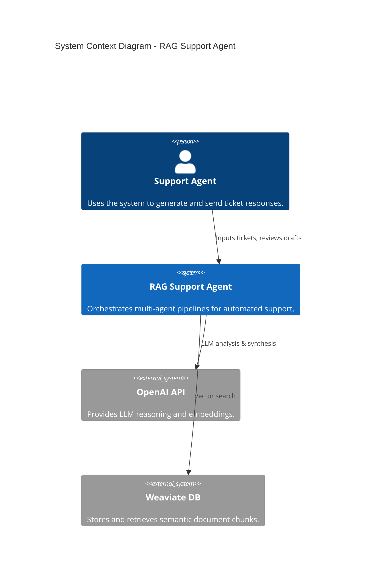
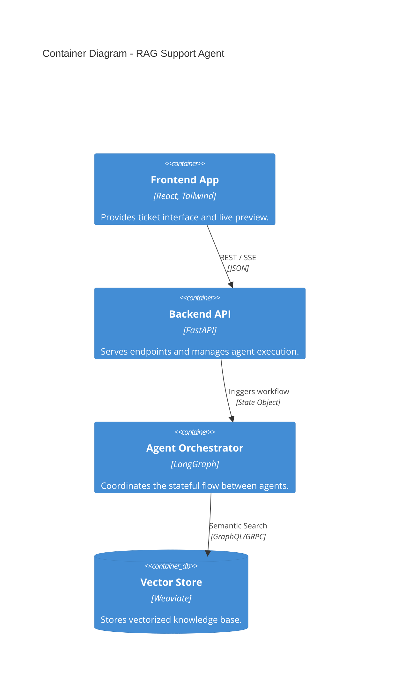
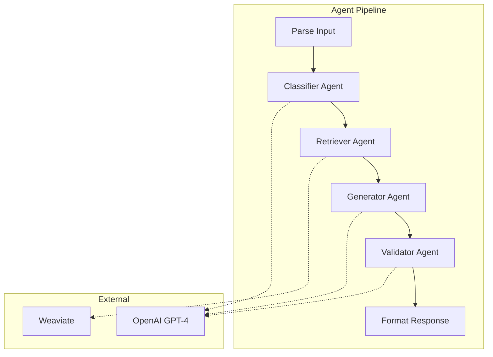

# Architecture Overview

## System Context (C4 Level 1)

The RAG Support Agent interacts with customers (via the UI) and uses OpenAI as an external LLM provider. Knowledge is stored in a Weaviate vector database.

## Container Architecture (C4 Level 2)

The system is composed of a React frontend and a FastAPI backend. The backend uses LangGraph to coordinate different specialist agents.

## Component Architecture (C4 Level 3)

The LangGraph "Agent Orchestrator" manages a linear pipeline of specialized nodes.

## Architectural Patterns

- **RAG (Retrieval-Augmented Generation)**: Leverages semantic search to give the LLM context-specific knowledge, reducing hallucinations.
- **Multi-Agent Orchestration**: Breaks down complex tasks into smaller, specialized steps (Classification -> Retrieval -> Generation).
- **Event-Driven UI Updates**: Uses Server-Sent Events (SSE) to stream long-running agent processes back to the client for a responsive feel.

## Key Design Decisions

1.  **LangGraph for State Management**: Chosen to handle the complex, multi-step nature of the agent pipeline with reproducible state and easier debugging.
2.  **Weaviate for Vector Search**: Provides high-performance semantic search with a flexible schema, ideal for evolving knowledge bases.
3.  **CopilotKit for Frontend AI**: Used to seamlessly integrate AI capabilities (like readable state and actions) into the React interface.
