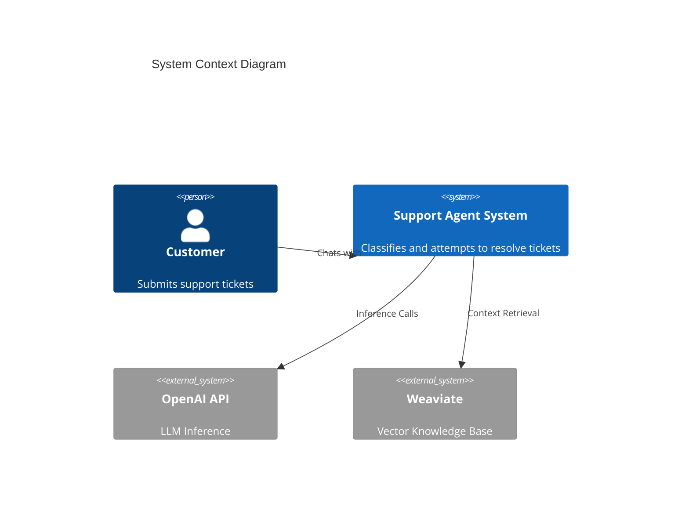
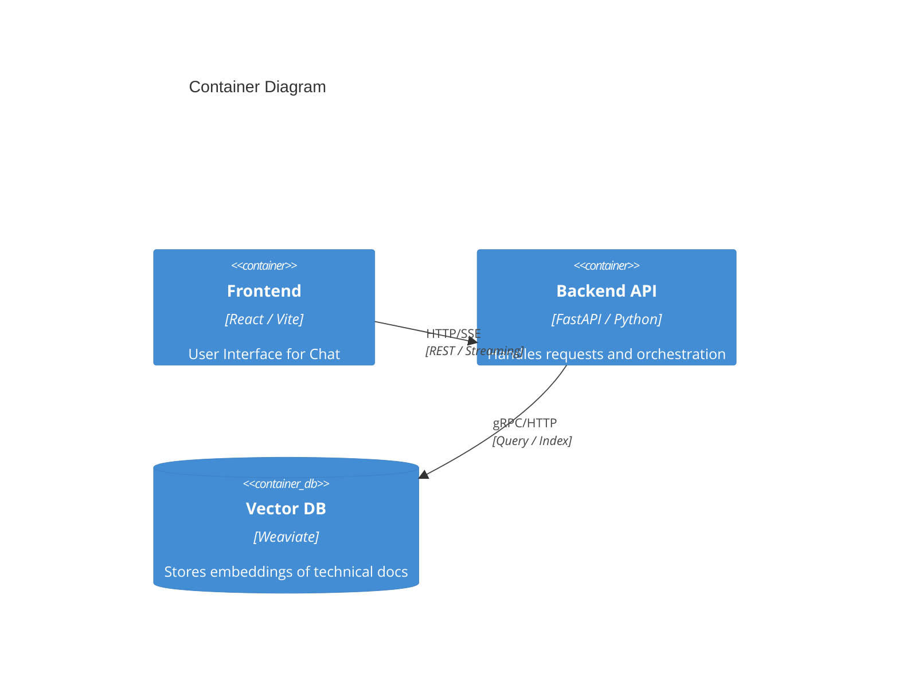
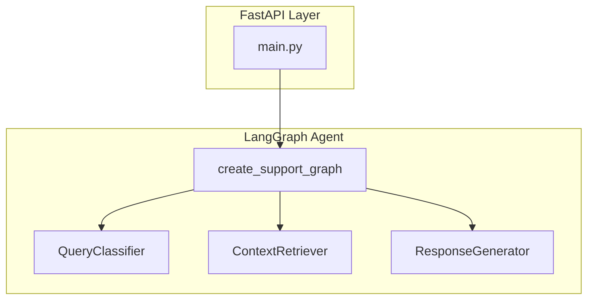

# Architecture Overview

## System Context (C4 Level 1)

The system mediates between Customer Users and Support Staff (via the AI Agent).

## Container Architecture (C4 Level 2)

The application consists of a SPA frontend and a FastAPI backend orchestrating AI agents.

## Component Architecture (C4 Level 3) - Backend

The backend is structured around a LangGraph state machine.

## Key Design Decisions

1. **LangGraph State Machine**:
   - **Rationale**: Allows cyclic and conditional workflows (e.g., critique -> retry) which are hard to manage with linear chains.
   - **Trade-offs**: Slightly higher complexity than simple chains.

2. **Weaviate as Vector Store**:
   - **Rationale**: Production-ready, handles metadata filtering well (critical for category-scoped search).

3. **SSE for Streaming**:
   - **Rationale**: Native browser support, easier than WebSockets for uni-directional chat streams.
