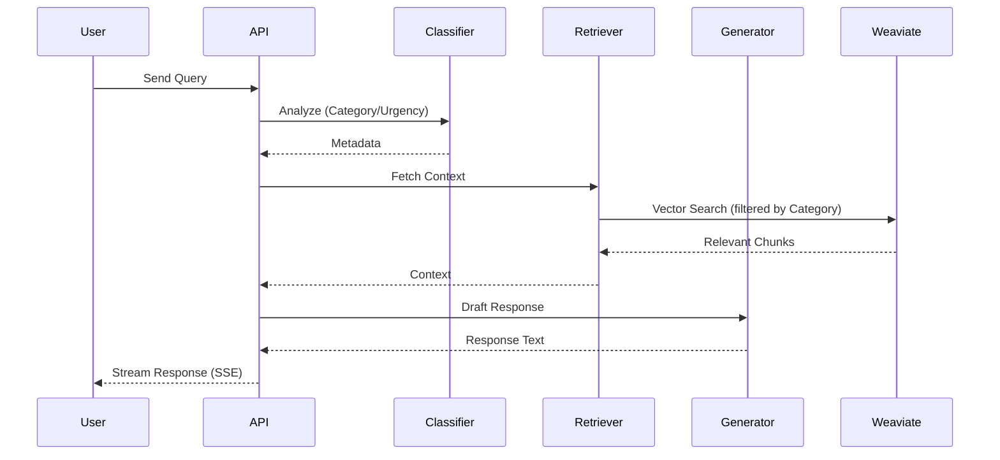
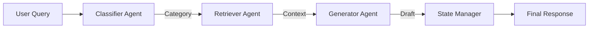

# Workflow Overview

## Core Support Workflow

The system follows a "classify, retrieve, generate" pattern, orchestrated by LangGraph.

## Data Flow

## State Management

The `TicketState` dict manages the request lifecycle:

- `ticket_id`: Unique identifier
- `customer_query`: Original input
- `category`: Technical/Billing/Feature/Bug
- `confidence_score`: Float 0-1
- `draft_response`: The LLM generation
