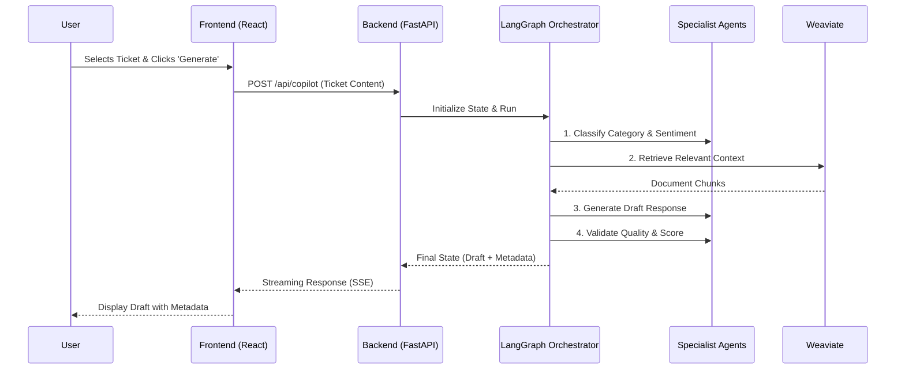
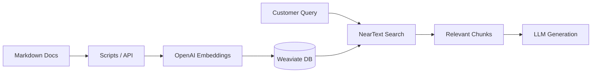

# Workflow Overview

## Core Workflows

### Ticket Processing Pipeline

This is the primary workflow where a support ticket is analyzed and a response is generated.

### Data Flow for RAG

The knowledge base ingestion and retrieval flow ensures the model has access to the latest company information.

## Error Handling

- **Agent Failure**: If an agent fails to generate a response, the workflow falls back to a "Human Review Required" state with a generic message.
- **Database Connection**: If Weaviate is unreachable, the system attempts to generate a response without RAG context (if appropriate) or flags a connection error.
- **Rate Limiting**: The system handles LLM rate limits by implementing retry logic in the agent chains.

## State Management

The `TicketState` object is passed between agents and updated at each step. This allows for:
1.  **Observability**: Each agent's output can be logged and inspected.
2.  **Persistence**: The state can be saved to a database for long-running workflows or late review.
3.  **Critique & Repair**: The Validator agent can modify the state if it detects poor quality, triggering a re-generation loop if necessary.
