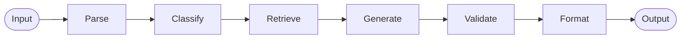

# Deep Dive: Agent Pipeline

## Overview

The Agent Pipeline is the core of the RAG Support system. It is implemented as a stateful graph using LangGraph, which allows for complex decision-making and reliable execution flows.

## Responsibilities

- **Input Parsing**: Normalizes customer queries from various frontend sources.
- **Intent Classification**: Identifies the category, sentiment, and urgency of the request.
- **RAG Retrieval**: Searches the knowledge base for technically accurate context.
- **Response Synthesis**: Drafts a professional, empathetic response based on retrieved data.
- **Quality Validation**: Automatically critiques the draft for accuracy, tone, and formatting.

## Architecture

The pipeline follows a **Linear Directed Acyclic Graph (DAG)** structure, but can be extended with cycles for self-correction.



## Key Components

### 🧠 Classifier Agent (`backend/agents/classifier.py`)
Uses LLM reasoning to extract structured data from raw queries.
- **Output**: JSON containing `category`, `sentiment`, `urgency`.

### 🔍 Retriever Agent (`backend/agents/retriever.py`)
Coordinates with Weaviate to find the top search results.
- **Technique**: Vector search with optional filtering by category.
- **Output**: List of document chunks with relevance scores.

### ✍️ Generator Agent (`backend/agents/generator.py`)
Synthesizes the final draft using RAG context.
- **Prompting**: Structured template ensuring professional tone and citations.
- **Output**: Draft response text.

### ✅ Validator Agent (`backend/agents/validator.py`)
Acts as a quality control layer.
- **Criteria**: Fact-checking against context, sentiment alignment, and formatting.
- **Output**: `confidence_score` and `critique` notes.

## Implementation Details

The graph is compiled with a `MemorySaver` checkpointer, allowing the system to maintain "thread" state for multi-turn interactions.

```python
# From backend/graph.py
workflow = StateGraph(TicketState)
workflow.add_node("classify", classifier.run)
# ... edges ...
return workflow.compile(checkpointer=memory)
```

## Dependencies

- **LangGraph**: For graph orchestration.
- **LangChain OpenAI**: For seamless integration with GPT models.
- **Pydantic**: For type-safe state schemas.
